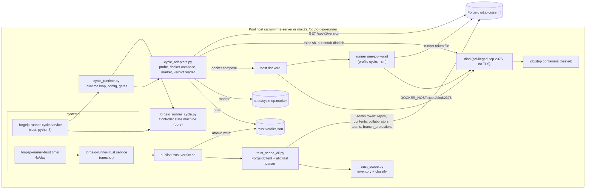
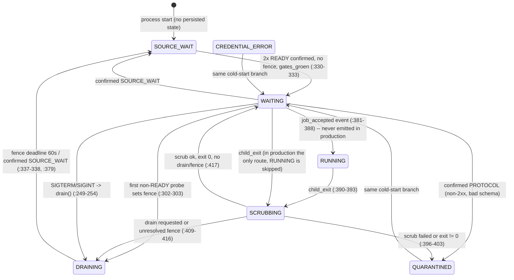
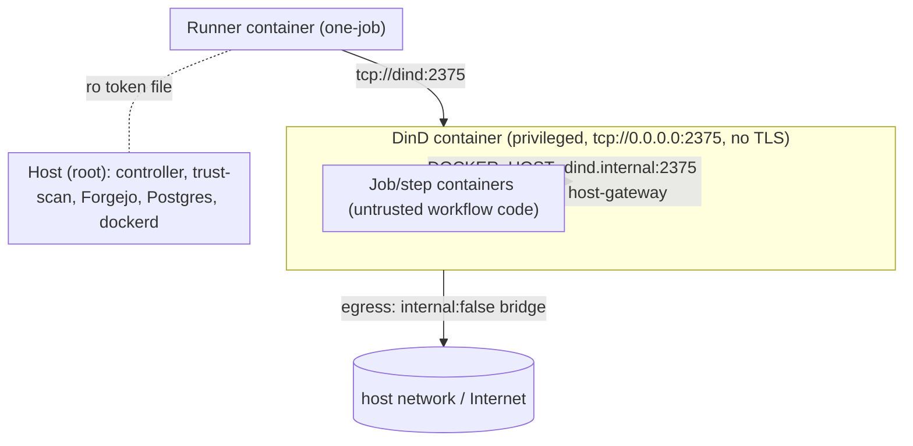

# Architecture as implemented — scrum4me-server

> **Lead note.** The controller behaviours described in §3.7 and §8 were reproduced by the lead with the
> repository's own fake-adapter harness; see [executive-summary.md](executive-summary.md) and
> [findings.json](findings.json) (AUDIT-003 … AUDIT-007).

Audit baseline: branch `claude/repo-engineering-audit-66e5a7`, commit `4d9f873`. Read-only audit; nothing was executed.
Labels: **Observed** = read in code/config at the cited lines. **Inferred** = derived from observed facts but not directly shown.
Paths are relative to the repository root; `path:a-b` are line ranges.

## 1. What the repository is

An infrastructure repo with two unrelated deliverables plus documentation:

1. `forgejo-runner/` — the runner-pool bundle rolled out by hand to `/opt/forgejo-runner/` on two hosts (`scrum4me-server`, `max2`).
2. `scripts/` — stand-alone host-ops tools with no shared code between them (except `compose-git-init` loading `compose-git-pre-commit` as a module, `scripts/compose-git-init:29-34`).

No package manifest, no build, no CI (Observed, `repository-map.md`). Everything runs from a checkout or a copy on a host.

## 2. Component diagram



### File-level dependencies (Observed)

| Caller | Callee | Evidence |
|---|---|---|
| `forgejo_runner_cycle.py` `__main__` | `cycle_runtime.main` | `forgejo_runner_cycle.py:420-422` |
| `cycle_runtime.py` | imports `Controller, EventLoop, ReadinessClass, State, classify_probe, CONFIRM_SECONDS` | `cycle_runtime.py:16-23` |
| `cycle_runtime.py` | lazy-imports all adapters | `cycle_runtime.py:361-371` |
| `cycle_runtime.py` | locates `scrub-dind.sh` next to itself | `cycle_runtime.py:373` |
| `cycle_adapters.py` | no project imports (stdlib only) | `cycle_adapters.py:3-10` |
| `trust_scope_cli.py` | `trust_scope.inventory/classify/Unreadable` | `trust_scope_cli.py:14-15,199,236` |
| `trust_scope.py` | no I/O; client injected | `trust_scope.py:1-7` |
| `verify-trust-scope.sh` | `trust_scope_cli.py` (manual entry, not used by systemd) | `verify-trust-scope.sh:15-16` |
| `publish-trust-verdict.sh` | `trust_scope_cli.py` via `--cli-py` | `publish-trust-verdict.sh:25` |
| `verify-stack.sh` | `bundle-hash.sh` | `verify-stack.sh:24` |

`verify-trust-scope.sh` is not referenced by any unit (Observed: `forgejo-runner-trust.service:23-28` calls `publish-trust-verdict.sh` directly). Inferred: it is a manual/legacy entry point.

## 3. The cycle controller

### 3.1 Layering (Observed)

* **Decision core** `forgejo_runner_cycle.py`: pure logic, no I/O. `classify_probe` (`:38-61`), `Confirmation` two-observation rule (`:64-83`), `EventLoop` monotonic `event_seq` (`:105-123`), `Fence` (`:126-146`), `MaintenanceRecord` (`:152-183`), `Controller` (`:217-417`).
* **Runtime shell** `cycle_runtime.py`: config (`:52-71`), gate evaluation (`:90-109`, `:181-192`), operation supervision (`:209-238`), child supervision (`:240-251`), stop protocol (`:319-358`), `main` (`:397-418`).
* **Adapters** `cycle_adapters.py`: HTTP probe (`:18-59`), `docker compose` wrappers (`:66-146`), reconcile + marker (`:153-208`), verdict reader (`:211-223`).

The Runtime keeps a second, independent readiness tracker (`ReadinessConfirmed`, `cycle_runtime.py:112-126`) in addition to the core's `Confirmation`; `_may_start` requires both (`:197-207`).

### 3.2 States and transitions

States: `SOURCE_WAIT, CREDENTIAL_ERROR, WAITING, RUNNING, DRAINING, SCRUBBING, QUARANTINED` (`forgejo_runner_cycle.py:86-93`). Boot state is `SOURCE_WAIT` (`:221`); nothing is persisted, so every process start begins there (Observed; the unit comment at `forgejo-runner-cycle.service:12-15` says the controller "houdt zijn eigen toestand vast" — see ARCH-5).



`CREDENTIAL_ERROR` is only reachable when a probe carries `kind == "auth"` (`:57`). The only probe implementation always returns `kind: "general"` (`cycle_adapters.py:38,46,55`), so 401/403 classify as `PROTOCOL` -> `QUARANTINED`. This is a documented deferral (`controller-entrypoint-ontwerp.md:37-46`).

### 3.3 Gates before a runner starts (Observed)

`_may_start` (`cycle_runtime.py:197-207`) is a conjunction of:

| Gate | Source |
|---|---|
| not `_blocked`, not `_stop`, no op/child in flight | `:199-201` |
| `Controller.mag_child_starten`: no fence, no drain, `gates_groen`, state in `WAITING/SOURCE_WAIT` | `forgejo_runner_cycle.py:256-268` |
| state == `WAITING` | `cycle_runtime.py:203` |
| Runtime readiness confirmed (2 READY >= 5 s apart) | `:204`, `:112-126` |
| `clean_proven` (a scrub succeeded since the last child) | `:205`, `:228` |
| pre-pull queue empty (all digests from `allowed-job-images.txt` pulled) | `:206`, `:155-162` |

`gates_groen = trust verdict green AND dind healthy` (`:185-192`). Verdict green (`:90-109`): object; `ok is True`; finite numeric `measured_at`; `0 <= age <= verdict_max_age`; `forgejo_target` equals configured URL; `labels_sha256` and `allowlist_sha256` equal the SHA-256 of the local files. Age is judged on `measured_at`, not mtime.

Trust and DinD gates are evaluated only every `retry_interval` (30 s) (`:271-280`). Trust transitions are logged (`:168-179`).

### 3.4 Job lifecycle (Observed)

`tick()` order (`cycle_runtime.py:268-288`): load digests -> (every 30 s) `docker compose up -d dind`, probe, gates -> watchdog `controller.tick` -> one-time reconcile -> advance op -> advance child -> drive cycle -> start runner if allowed -> drain events to log.

1. Start: `docker compose -f … -p … --profile cycle run --rm runner` as a `Popen` child (`cycle_adapters.py:90-91`). `clean_proven` is reset to False at start (`cycle_runtime.py:263-266`).
2. Runner command is `forgejo-runner … one-job --wait` (`compose.yaml:43`), i.e. it polls Forgejo for one job, runs it, exits.
3. On child exit: `child_exit` event -> core goes `SCRUBBING`; pull queue refilled; a scrub is started unless stopping (`cycle_runtime.py:240-251`).
4. Scrub: `docker compose exec -T dind sh -s -- --endpoint tcp://127.0.0.1:2375 --allow /etc/forgejo-runner/allowed-job-images.txt` with `scrub-dind.sh` on stdin (`cycle_adapters.py:126-143`). `scrub-dind.sh` removes all containers, volumes, non-default networks, build cache and non-allow-listed images inside DinD, then measures and exits 0/50/51 (`scrub-dind.sh:41-87`).
5. Then pre-pull each allow-listed digest inside DinD (`cycle_adapters.py:101-114`), then the next runner may start.

### 3.5 What persists on disk

| Path | Written by | Purpose |
|---|---|---|
| `state/cycle-op.marker` (`{"op": kind}`) | `Reconcile.write_marker`, tmp+`os.replace` (`cycle_adapters.py:193-198`) | "an in-flight pull/scrub was interrupted"; written before every op (`cycle_runtime.py:210`), removed only if the op ended with rc >= 0 (`:222-225`) |
| `trust-verdict.json` | `publish-trust-verdict.sh` | gate input |
| `BUNDLE_COMMIT`, `runner-config.yml`, `.env`, `controller.toml`, `credentials/` | operator | host-local, excluded from bundle hash (`bundle-hash.sh:31-40`) |

Nothing else: no state file for the FSM, fence or quarantine (Observed: the only `open(..., "w")` in the runtime is the marker).

### 3.6 Startup reconciliation and stop protocol (Observed)

* `_reconcile_once` (`cycle_runtime.py:299-317`): if any runner-service container exists (`docker ps -a` with compose labels, `cycle_adapters.py:167-188`) -> `_blocked = True` (fail closed). If the marker exists -> `kill dind` + `up -d dind`, `clean_proven=False`, forced scrub. Any exception -> `_blocked`.
* SIGTERM/SIGINT -> `request_stop` (`:319-325`, `:346-347`): `_stop=True`, `controller.drain`, SIGTERM to the runner child and to any in-flight op. Loop exits when nothing is in flight and no runner container remains, or after `child_stop_grace` (200 s, `controller.toml.example:21`); exit code 0 only when stop was clean and no marker remains (`:335-340`). systemd `TimeoutStopSec=300`, `KillSignal=SIGTERM` (`forgejo-runner-cycle.service:17-18`).
* `_blocked` is set in four places and never cleared (`cycle_runtime.py:147,237,305-317` — grep for `_blocked = False` yields only the initialiser).

### 3.7 What the runtime does NOT do (Observed, gaps against design)

* `job_accepted`, assignment zero-proof (`assignment_nulbewijs`), maintenance arming and `algemene_readiness_bevestigd` are only ever driven from tests: no production code submits `job_accepted` or sets `nulbewijs_ok`/`maintenance` (grep across `forgejo-runner/scripts/*.py`). Consequence: production state never reaches `RUNNING`.
* No production code stops a runner that is idle in `one-job --wait` when the fence/gate goes red; the gate is checked only at start (`cycle_runtime.py:263-266`, no call to `runner.request_stop` outside `request_stop`, `:319-325`).
* No deadline exists for a pull or scrub op (`cycle_runtime.py`: `_advance_op` `:214-238` only polls). `scrub-dind.sh` checks its 300 s budget only after all work completes (`scrub-dind.sh:84-86`).

## 4. Trust pipeline (end to end)

```mermaid
sequenceDiagram
  participant T as trust.timer (00,06,12,18h +-5min, Persistent)
  participant S as trust.service (oneshot, EnvironmentFile=trust-scan.env)
  participant P as publish-trust-verdict.sh
  participant C as trust_scope_cli.py
  participant M as trust_scope.py
  participant F as Forgejo API
  participant V as trust-verdict.json
  participant R as cycle_runtime (every 30s)
  T->>S: start
  S->>P: /bin/sh publish-trust-verdict.sh --cli-py --labels --allowlist --target --out
  P->>C: FORGEJO_URL=target python3 cli --out mktemp -d
  C->>F: /repos/search, contents, collaborators, permission, teams, members, branch_protections
  C->>M: inventory(client, labels); classify(inv, allowlist)
  C-->>P: exit 0 green / 10 soft / 20 hard / 30 unreadable
  P->>V: atomic replace: ok=true only for exit 0 or 10 (+labels/allowlist sha256, measured_at, target); otherwise ok=false
  R->>V: read, check ok, age <= 86400s, target, sha256 bindings
  R-->>R: gates_groen -> mag_child_starten
```

Observed details:

* Timer: `OnCalendar=*-*-* 00,06,12,18:00:00`, `RandomizedDelaySec=300`, `Persistent=true` (`forgejo-runner-trust.timer:12-18`). Service: `Type=oneshot`, retries `Restart=on-failure` with `StartLimitBurst=5` in 1800 s, `ProtectSystem=strict`, `ReadWritePaths=/opt/forgejo-runner`, `PrivateTmp=true` (`forgejo-runner-trust.service:10-40`).
* Inventory (`trust_scope.py:201-277`): per repository visible to the token, if `has_actions`: list `.forgejo/workflows` then `.github/workflows` (`:36-45`), text-scan each workflow for `pull_request_target|pull_request|workflow_run` and for the shared label names (`:110-127`, no YAML parser by design); writers = owner + write/admin collaborators + members of write/admin teams (`:133-198`); branch protections of the default branch. Any malformed/absent datum -> `Unreadable` -> fail closed.
* Classification (`trust_scope.py:280-376`): hard = Actions-enabled repo not on the allow-list; writer not an approved identity or not listed for that repo; risky trigger on a shared label without a per-repo acknowledgement. Soft = new repo without Actions, missing workflow dir, risky trigger without shared label, shared label without branch protection. `unreadable` and `hard` make `ok` false (`:31-33`).
* CLI exit codes (`trust_scope_cli.py:253-259`): unreadable 30 > hard 20 > soft 10 > 0. Allow-list without `approved_by` -> exit 30 (`:232-234`).
* Wrapper (`publish-trust-verdict.sh:51-81`): green only for CLI exit 0, or 10 with a non-empty `soft` list (and exit 0 with an empty one). Any failure writes `ok:false` (+ a second shell-level fallback write, `:83-93`) so a previous green never survives a failed measurement.
* Consumer: `TrustVerdictReader.read` returns the parsed JSON (or `None`) plus SHA-256 of `labels.txt` and `trusted-actions-scope.yml` (`cycle_adapters.py:211-231`); `verdict_green` applies the checks in section 3.3.
* Scope: default branch only (`README` "Verifiëren"; the scanner reads contents of the repo default ref, `trust_scope_cli.py:96`). Inferred: workflows on non-default branches/PR heads are not measured.
* Hard trust deviation does not produce `QUARANTINED` in the controller; it only turns `gates_groen` false (`controller-entrypoint-ontwerp.md:323-326`, "Bewuste beperking"). The migration design expects quarantine on both hosts (`migratieontwerp.md:270`).

## 5. Deploy path (Observed)

All manual; nothing in this repo pushes to hosts.

| Step | Script | Behaviour |
|---|---|---|
| Gate | `preflight.sh` | reads a facts TSV and `caps.env`; FAIL (exit 40) if runner+DinD CPU > 50% vCPU, memory > 50% available, disk < 20% free or < images+20 GiB, inodes < 20% (`preflight.sh:39-76`) |
| Config | `render-config.sh` | `policy + server.connections.forgejo{url,uuid,token_url,labels}`; validates UUID shape, non-empty labels, every label pinned to `@sha256:` (`render-config.sh:26-52`) |
| Digest resolve | `resolve-digests.sh` | `docker buildx imagetools inspect`, emits index digest (`resolve-digests.sh:16`) |
| Drift | `bundle-hash.sh` | SHA-256 over path+content of all bundle files except tests/, credentials/, state/, `__pycache__`, `.env`, `runner-config.yml`, `BUNDLE_COMMIT`, `controller.toml`, `trust-verdict.json` (`bundle-hash.sh:31-40`) |
| Verify | `verify-stack.sh COMMIT HASH` | compares `/opt/forgejo-runner/BUNDLE_COMMIT` and bundle hash to expectations (exit 60/61); fails (62) if anything listens on 2375/2376 on the host (`verify-stack.sh:19-32`) |
| Scrub | `scrub-dind.sh` | run by the controller, see 3.4 |

Inferred: cross-host equality is proven only by running `verify-stack.sh` with the same arguments on each host; no script compares the two hosts directly.

Not covered by the hash or by `verify-stack.sh` (Observed): the rendered `runner-config.yml` against `labels.txt`/policy, and the installed systemd unit files under `/etc/systemd/system` against the bundle copies. The README does not say how unit files reach `/etc/systemd/system` (`forgejo-runner/README.md` steps 1-10 contain `systemctl enable --now` but no copy/link step).

## 6. Host-ops scripts (`scripts/`)

| Tool | Entry -> external system | Notes |
|---|---|---|
| `rotate-env-credential` (subcommands `rewrite`, `rollback`, `alter-role`, `probe`, `scan`, `rewrite-key`, `classes`) | secret on stdin (`read_secret` `:39-47`); `alter-role` -> `docker exec -i scrum4me-postgres psql` with a SCRAM verifier computed locally (`:382-400`); `probe` -> `docker run --rm --network host --env-file <0600 tmp> postgres:17 psql` (`:412-443`); file edits with timestamped `.bak-<stamp>` + atomic replace + rollback on any interruption (`:199-229`) | The DB change and the file rewrites are separate commands; sequencing lives in `docs/runbooks/credential-rotation.md`, not in code (Inferred) |
| `compose-inpak` (`plan`, `run`) | list `<sha256>  <path>` -> `docker compose ls --all --format json` (registered configs) -> `tar` -> read back + hash -> per-file re-check -> `os.remove` -> post-check that compose projects/config hashes are unchanged (`:129-235`) | Refuses registered compose configs and anything under `--current-link` |
| `compose-git-init` + `compose-git-pre-commit` | `git init` in a live compose dir, `.gitignore` allow-list, copies hook into `.git/hooks/pre-commit`, first commit, verifies tracked set (`:86-121`); hook blocks non-allow-listed paths and literal secret-shaped values (`compose-git-pre-commit:22-56,72-105`) | Refuses root (`:47-48`); rolls back `.git` on failure (`:112-116`) |
| `forgejo-mirror/forgejo-mirror-sync.sh` + `-lib.sh` | env from `/etc/forgejo-mirror/{forgejo,github}.env` (`sync:26-41`) -> `flock` -> preflight (Forgejo >= 13, swagger `branch_filter`, both tokens) -> enumerate user repos -> per repo: skip if `.github/workflows`, GitHub counterpart exists, default-branch parity, ensure Forgejo push-mirror (DELETE+POST on drift), trigger `push_mirrors-sync`, poll, verify SHA and tags, `tags_fallback` via local bare clone + `git push --tags --force` (`lib:120-425`); state in `/var/lib/forgejo-mirror/state.json` | The GitHub PAT is handed to Forgejo as `remote_password` (`lib:277-282`) |
| `docker-rollback-retention/docker-rollback-retention.sh` | `docker ps -aq` (in-use image IDs) + `docker images` -> keep newest N `*rollback*` tags per repository -> `docker rmi repo:tag` (no `-f`) on `--apply`; default is dry-run (`:31-61`) | Only local Docker daemon |

Read-through of `scripts/tests/` and `forgejo-runner/tests/` is out of scope here.

## 7. Trust boundaries, tokens, data ownership



Observed:

* DinD: `privileged: true`, `dockerd --host=tcp://0.0.0.0:2375 --tls=false` (`compose.yaml:10-11`); network `runner-control` is a normal bridge, `internal: false`, no published ports (`:63-66`).
* Job containers are configured non-privileged, no socket, `valid_volumes: []`, and reach DinD through `DOCKER_HOST=tcp://dind.internal:2375` with `--add-host=dind.internal:host-gateway` (`runner-config.policy.yml:13-24`). Inferred: a job can therefore talk to the unauthenticated privileged DinD daemon and start privileged containers inside it; the only barrier to the host is the DinD container boundary. This is an accepted residual risk in the design (`trusted-actions-scope.yml:12-28`, `compose.yaml:10` "bewuste keuze, §7.6").
* Runner token: host file `/opt/forgejo-runner/credentials/forgejo-token`, mounted read-only into the runner container only (`compose.yaml:53`); DinD and job containers do not get it.
* Trust-scan token: separate `credentials/trust-scan.env`, root 0600, needs admin on every Actions-enabled repo (`forgejo-runner/README.md` step 9); consumed by the oneshot service only.
* Controller: runs as root (no `User=`), uses the host Docker daemon via the CLI, has no Forgejo credential; the probe is unauthenticated (`cycle_adapters.py:18-24`). `NoNewPrivileges=true`, `ProtectHome=true` only (`forgejo-runner-cycle.service:19-21`).
* Verdict integrity: the verdict file carries no signature; integrity rests on file ownership (Inferred: root-only write under `/opt/forgejo-runner`). A process with host root, or a DinD escape, can forge a green verdict.
* Data ownership: Forgejo owns repos/permissions (read-only for this repo's tools, except the mirror which mutates push-mirror config); Postgres role passwords are mutated by `rotate-env-credential`; runner registration UUID/token are host-local; the FSM has no owner-of-record store.

## 8. Design conformance (spot checks)

| Design claim | Implementation | Verdict |
|---|---|---|
| Vier-way readiness classification, 401/403 on auth probe -> `CREDENTIAL_ERROR` (`migratieontwerp.md:255-257,357`) | Classifier exists; no auth probe (`cycle_adapters.py:38`) | Deferred by design (`controller-entrypoint-ontwerp.md:43`) |
| Scrub after every exit; runner failure ends in `QUARANTINED` and does not reopen (`migratieontwerp.md:335,339`) | `QUARANTINED` set (`forgejo_runner_cycle.py:399-403`) but the cold-start branch reopens it on the next confirmed READY (`:330-333`) | Mismatch, acknowledged in `controller-entrypoint-ontwerp.md:303-309` (see ARCH-3) |
| A `WAITING` runner is gracefully stopped when the source degrades (`migratieontwerp.md:115`) | No such action in runtime | Mismatch (see ARCH-1) |
| Reguliere scrub max 5 min, overshoot quarantines and alerts (`migratieontwerp.md:347`) | No op deadline in runtime | Mismatch (see ARCH-4) |
| Hard trust deviation -> both controllers `QUARANTINED` (`migratieontwerp.md:270`) | Only `gates_groen=False` | Deferred (`controller-entrypoint-ontwerp.md:323-326`) |
| Unit-restart never bypasses a fence or quarantine (`forgejo-runner-cycle.service:12-15`, `migratieontwerp.md:115`) | State is in memory; restart resets to `SOURCE_WAIT` and re-gates | Partially true: gates re-run, but quarantine/fence do not survive (see ARCH-5) |
| Bundle hash covers deployable files, tests excluded (`forgejo-runner/README.md`) | Matches `bundle-hash.sh:31-40` | Conforms |
| No secrets in Git; token never in compose/config | `render-config.sh` uses `token_url` file (`:47`) | Conforms |

## 9. Documentation vs tree mismatches (Observed)

* `CLAUDE.md`, `AGENTS.md`: "deze repo bevat nog geen code", `forgejo-runner/` "nee — ontstaat in stap B", "het uitvoerbare implementatieplan bestaat nog niet". The tree has `forgejo-runner/` (66 files), `docs/forgejo-runner-pool/implementatieplan-*.md` (four files), and `scripts/`. Neither file mentions `scripts/`.
* `README.md` (root) also lists `forgejo-runner/` as "nog niet aangemaakt".
* `forgejo-runner/forgejo-runner-cycle.service:12-15` says the controller keeps its own state; it does not (section 3.5).
* `forgejo-runner/README.md` step 10 states the gate "logt zijn reden niet"; since commit `2dced4a` the runtime logs trust transitions (`cycle_runtime.py:168-179`). Stale doc.

## 10. Referenced but absent from the repo

| Referenced | Where | State |
|---|---|---|
| `hosts/scrum4me-server/` overlay | `CLAUDE.md`, `AGENTS.md`, `README.md` | absent (`hosts/` does not exist) |
| systemd unit + timer for the mirror (`forgejo-mirror-sync.service`, 02:30 UTC) | `scripts/forgejo-mirror/README.md:3-4` | not in repo; only prose |
| Scheduler for `docker-rollback-retention.sh` | none referenced | no unit/cron in repo |
| `/etc/forgejo-mirror/{forgejo,github}.env`, `/srv/scrum4me/scripts/` install copy, dedicated user `forgejo-mirror` | mirror README and script | host-only |
| `controller.toml`, `state/`, `credentials/`, `.env`, `runner-config.yml`, `BUNDLE_COMMIT` | `forgejo-runner/README.md`, `bundle-hash.sh:6-10` | host-local by design |
| Installation of the three systemd units to `/etc/systemd/system` | `forgejo-runner/README.md` | no documented step |
| `docs/forgejo-runner-pool/evidence/stap-a/{caps.env,images.json,resolved-digests.tsv}` | `.env.example` comments | `evidence/stap-a` exists (contents not audited) |
